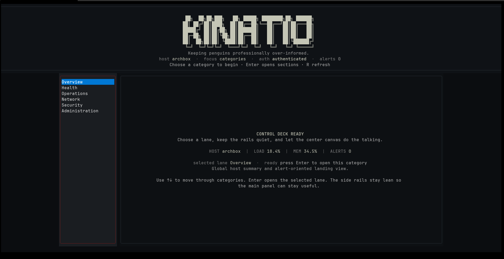
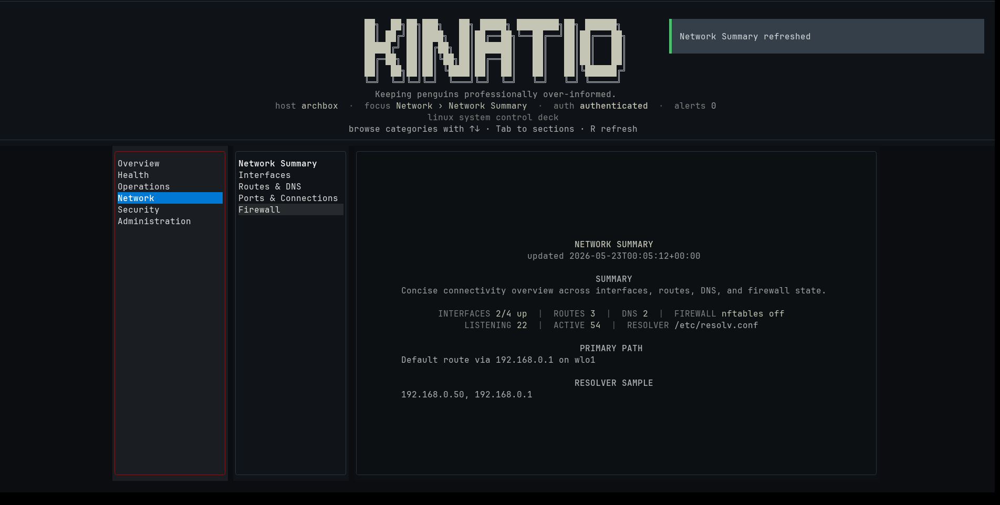

# Kinatio

Linux observability console with a Textual TUI and automation-friendly CLI.

Kinatio provides unified host introspection for Linux systems through an interactive terminal UI and structured CLI reporting surface. It is intentionally observe-only and designed for operators who want runtime, network, service, log, storage, package, and security visibility without deploying external infrastructure.

---

## Screenshots

### Overview



### Network summary



### Demo recording

[Watch the terminal demo (WebM)](docs/assets/kinatio-demo.webm)

---

## Why Kinatio?

Most Linux observability tooling is either:

* metrics-only
* GUI-heavy
* tied to external infrastructure
* narrowly focused on logs, processes, or networking
* unsuitable for SSH-first workflows

Kinatio focuses on unified terminal-native observability with:

* shared TUI and CLI runtime state
* multi-backend Linux support
* explicit privilege boundaries
* degraded-capability awareness
* structured JSON reporting
* local-first operation

Kinatio is not a control plane.

It does not:

* restart services
* mutate firewall rules
* orchestrate hosts
* perform automated remediation
* run background agents

---

## Features

### System observability

* host identity and kernel state
* uptime, load, and runtime context
* CPU, memory, thermal, and power telemetry
* process inventory and resource usage

### Network visibility

* interfaces and addresses
* routes and DNS
* listening ports
* active connections
* firewall posture

### Operations visibility

* service inventory
* package inventory and updates
* storage and SMART summaries
* container runtime inventory
* sessions and login history

### Logs and security posture

* journalctl/syslog/dmesg support
* live log follow mode
* SELinux/AppArmor visibility
* audit posture summaries
* bounded anomaly and exposure sampling

### Operator-focused behavior

* observe-only architecture
* structured JSON output
* explicit degraded-state reporting
* privilege-aware subsystem gating
* shared runtime across TUI and CLI

---

## Architecture Overview

```text
Collectors
    ↓
Collector Scheduler
    ↓
SystemStateStore
   ↙             ↘
CLI              TUI
```

Core architectural principles:

* collectors normalize data into a shared `SystemState`
* runtime services are shared between CLI and TUI
* privileged subsystems fail closed
* backend capability is explicit, never guessed
* cached privileged state is redacted before persistence

---

## Supported Linux Backends

### Service managers

* systemd
* OpenRC
* runit
* SysV-style hosts

### Log backends

* journalctl
* syslog
* dmesg

### Firewall backends

* ufw
* firewalld
* nftables

### Package managers

* dpkg
* rpm
* pacman
* apk

### Container runtimes

* docker
* podman

---

## Install

### Bootstrap installer

```bash
./install.sh
```

Developer install:

```bash
./install.sh --dev
```

---

### Manual install

Create a virtual environment:

```bash
python3.12 -m venv .venv
source .venv/bin/activate
```

Install Kinatio:

```bash
pip install -e .
```

Developer workflow:

```bash
pip install -e ".[dev]"
```

---

## Quick Start

Launch the TUI:

```bash
kinatio
```

List available sections:

```bash
kinatio sections
```

Inspect runtime and backend health:

```bash
kinatio status --json
```

Run structured reports:

```bash
kinatio scan system network storage
kinatio scan firewall --json
```

Unlock privileged sections when required:

```bash
kinatio scan logs --unlock
kinatio scan logs --follow --unlock
```

`--follow` is currently supported for logs only.

---

## Observe-Only Boundary

Kinatio is intentionally designed as an observation and reporting tool.

The public surface does not:

* restart services
* kill processes
* modify firewall state
* alter host configuration
* perform remediation actions

Privileged sections are explicitly gated and include:

* Logs
* Security
* Audit

When access is unavailable or deferred, Kinatio surfaces reduced-capability state instead of guessing.

---

## Runtime and Privilege Model

Kinatio shares a unified runtime across both CLI and TUI execution paths.

Key behaviors:

* collectors publish normalized subsystem state
* scheduler manages periodic and streaming refreshes
* runtime context detects supported host backends
* privileged subsystems defer cleanly until authenticated
* cached privileged data is redacted before persistence

Default cache path:

```text
~/.cache/kinatio/state.json
```

---

## Development

Run linting:

```bash
./.venv/bin/ruff check kinatio tests
```

Run tests:

```bash
./.venv/bin/python3 -m pytest -q
```

Build distributions:

```bash
python -m build
```

---

## Project Status

Current version:

```text
1.0.0
```

Current scope:

* Linux only
* local-first
* observe-only
* TUI + CLI observability

Strongest smoke-tested path currently remains:

* systemd
* journalctl
* Fedora/Arch/Debian-family hosts

---

## Documentation

* `QUICKSTART.md` — installation and first-run workflows
* `docs/README.md` — documentation index
* `docs/release-checklist.md` — release process notes
* `docs/audits/` — audit and review artifacts
* `CONTRIBUTING.md` — contributor workflow
* `SECURITY.md` — vulnerability reporting guidance
* `CHANGELOG.md` — notable changes

---

## License

MIT — see `LICENSE`.
